# arpiii
An arpeggiator and sequencer for Monome Grid using iii

Current Version 1.2.0

[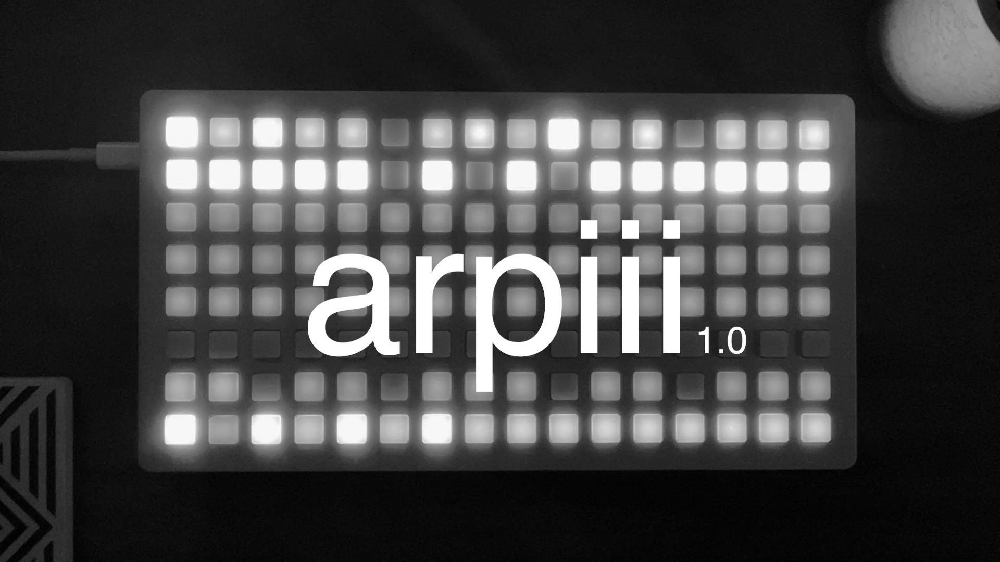](https://www.youtube.com/watch?v=BHH4k8Uw0lQ)

## Overview
Arpiii is a performance arpeggiator with control over all parameters right from the grid. The intuitive UI makes navigation and use as easy as possible without needing to memorize obscure button presses.

Arpiii is designed to achieve complex patterns in both note and gate and combines and expands upon powerful performance features found in many hardware and software synthesizers.

At the core of arpiii is a 64-step gate sequence grid, a two-octave keyboard, and a playback buffer that records the last 64 notes played.

Use arpiii as a stand alone controller for another device, or combine it with another keyboard to input MIDI notes.
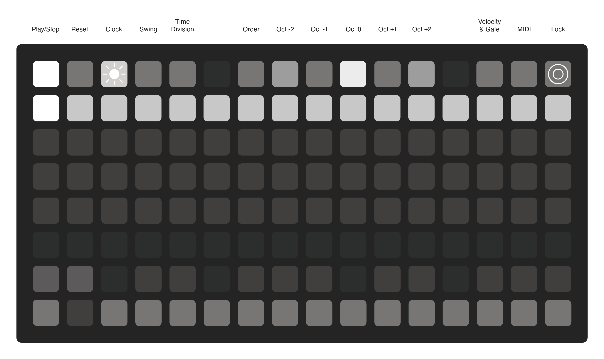

## Keyboard
**[A] Keyboard**  
The buttons here serve as a two-octave chromatic keyboard with the natural notes on the bottom row and the accidental notes on the top.

**[B] Octave Shift**  
These buttons shift the keyboard up or down by one octave. The keyboard can be shifted up to 3 octaves in either direction to extend past a typical 88 key piano.

_Shortcut:_  
Pressing both **[B]** octave buttons simultaneously will return the keyboard to the default position with middle c in the center.

**[C] Hold**  
The hold button can be activated to keep the pressed keys latched. It has two different modes depending on when it is pressed relative to the keys. If it is pressed before the keys on the keyboard, then subsequent keys on the keyboard can be added to the latched keys. If the hold button is pressed while holding keys down, then subsequent keys will replace the latched keys.
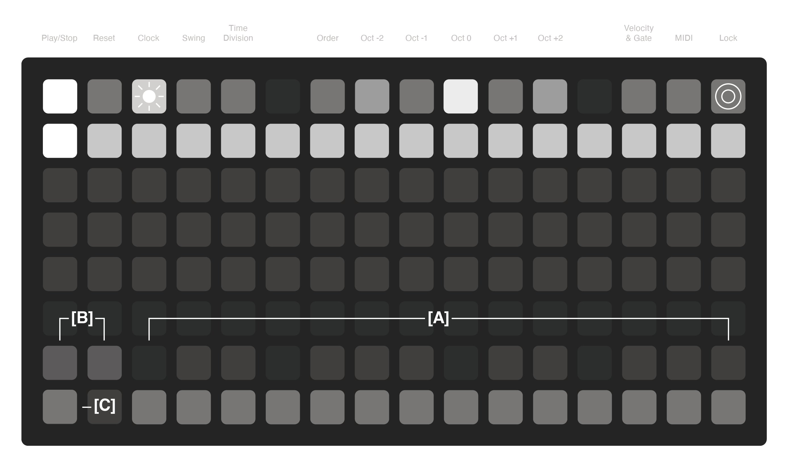

## Gate Sequencer
**[D] Gate Sequencer**  
This grid represents the gates that trigger a note in the arpeggio. The gate sequencer can have between 1 and 64 steps, with 16 being the default when loaded.

Hold any step in the gate sequencer grid to set the overall length of the sequence. Notes not included in the current sequence are dimly lit.

Steps can be turned on or off to introduce notes and rests and create a much more rhythmic arpeggio pattern. Notes that would have played during a rest are shifted to the next open gate, so no notes from the pattern are lost. 

The brightness of each step represents its velocity level, set to 96 by default and a gate length of 50%. The velocity and gates can be set per step or globally using the velocity and gate page.
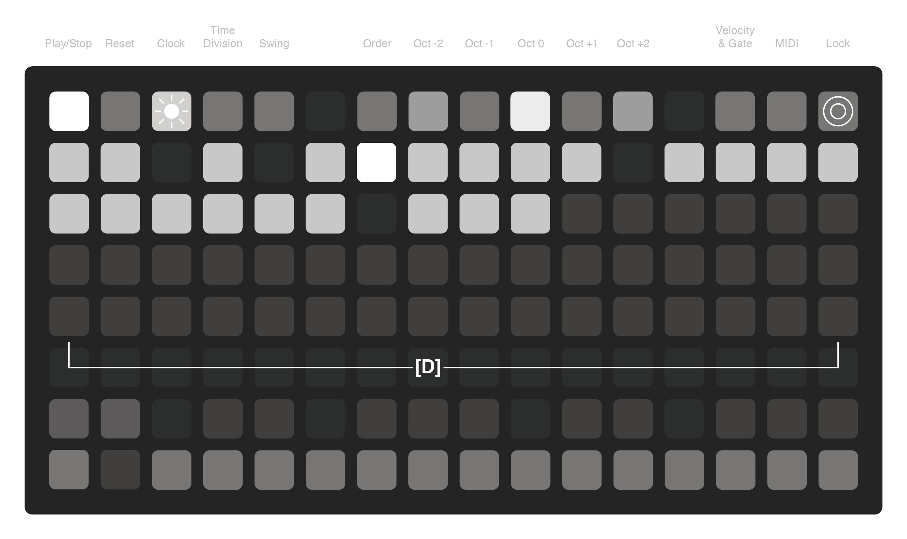

## Play/Stop & Reset
**[E] Play/Stop**  
This button starts and stops the gate sequencer. When clocking externally, this button only functions as a stop. The playhead will move across the current length of the grid. No notes will be heard using the keyboard if the sequence is not playing.

_Shortcut:_  
Holding **[E]** for 2 seconds will clear the notes, octaves, and reset the gate sequencer back to the default 16 steps to the set global velocity and gate length.

**[F] Reset**  
This button resets the gate sequencer back to the first step. Reset works in either clocking mode and can be handled by external resets sent through MIDI.

**[G] Playhead**  
The playhead moves along the gate sequencer showing where the sequence is in time.
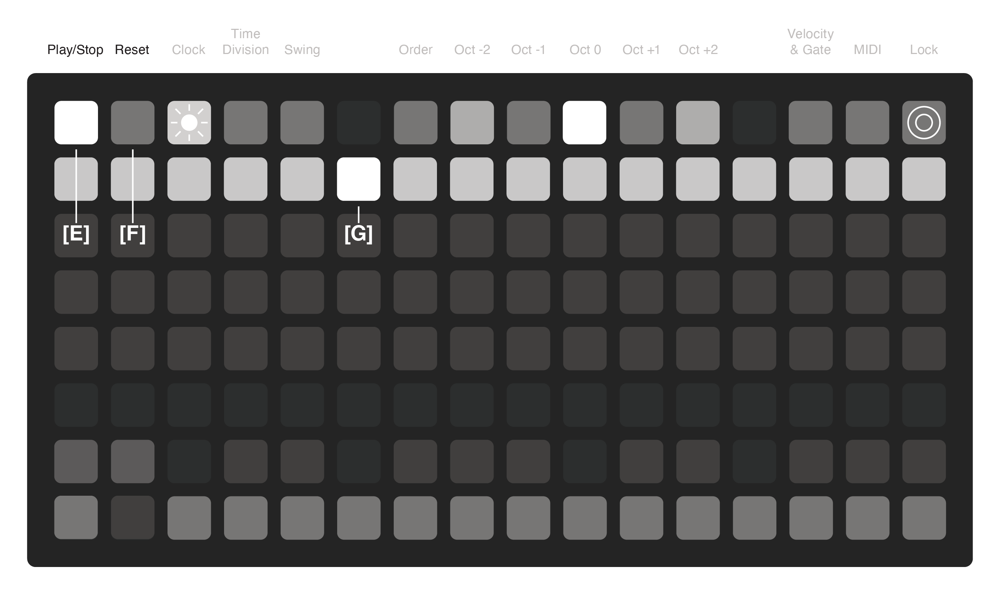

## Clock - Internal
**[H] Clock**  
The clock button toggles clock page and blinks at the current tempo.

**[I] Tap Tempo**  
This button is the tap tempo. Tap it ~4 times to set the internal tempo.

**[J] Internal Source**  
This button selects the internal clock and the BPM displays the current tempo.

**[K] Increments**  
The two sets of buttons next to the BPM display numbers are for increasing or decreasing the tempo.
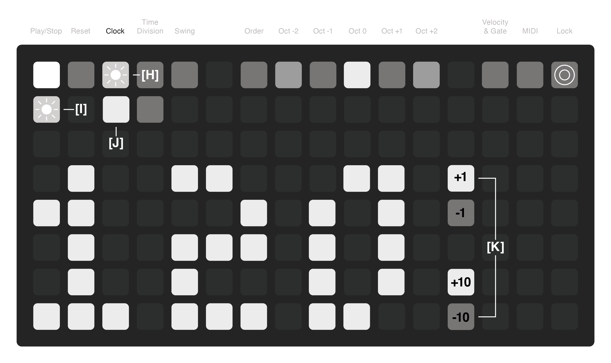

## Clock - External
**[L] External MIDI Source**  
This button sets the clock to look for an external MIDI signal. It responds to start, stop, and reset signals. EXT is now showing instead of the BPM display.

If the clock is set back to internal after using an external, the internal clock will reflect the previously used external clock (approximate).
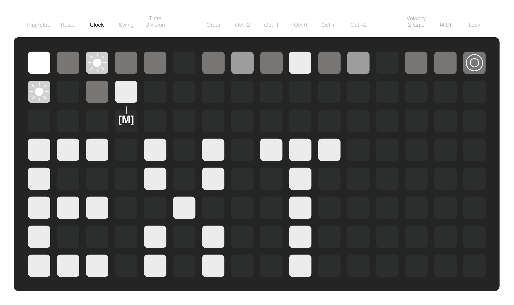

## Swing
**[M] Swing**  
This button toggles the Swing page and shows the current global swing value in the text display.

**[N] Increments**  
The two sets of buttons next to the number display are for increasing or decreasing the swing.

Swing can be adjusted from 25% to 75% with 50% being no swing. Swing set under 50% will cause the swung notes to arrive early and swing set over 50% will cause the swung notes to arrive late.
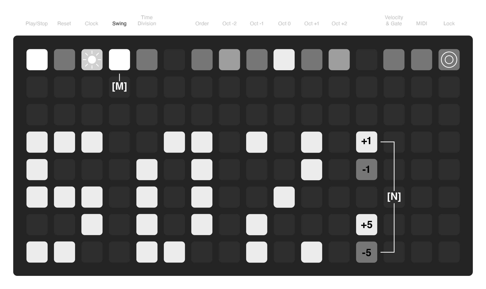

## Time Division
**[O] Time Division**  
This button shows the page for setting the time division the arpeggiator runs at relative to the main tempo. The current setting shown on the display text.

**[P] Division Options**  
The buttons allow for the time to be divided in musical division from 1 to 1/64 of a note.

**[Q] Division Modifiers**  
The modifier buttons allow the division to be switched between straight time, triplets, and dotted notes.
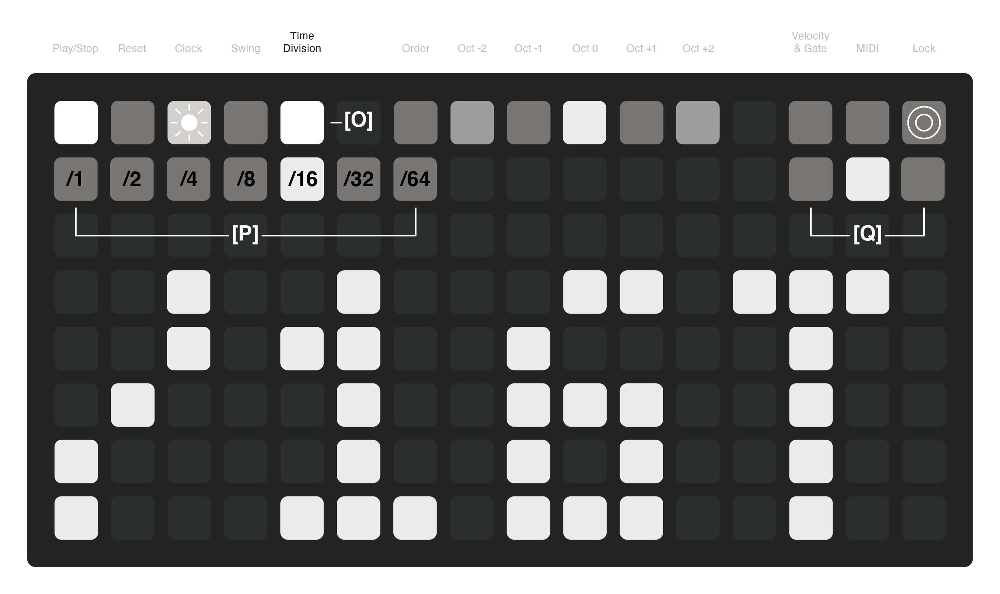

## Order - Options
**[R] Order**  
This button toggles the order page where you can choose the playback order for the arpeggiator.

**[S] Order Options**  
These options indicate the current arpeggio pattern. There are ten options giving a wide variety of classic, geometric, and generative sequences. The options are:  
Order - ORDR  
Linear - LINE  
Leap Frog - LEAP  
Stagger - STAG  
Shift - SHFT  
Spiral - SPRL  
Anchor - ANCH  
Accumulate - ACCM  
Drunken Walk - WALK  
Random - RAND  

There is a full description of each order on the next page.

**[T] Modifiers**  
These two buttons represent two modifier options for each playback order. For most of the orders, the first modifier reverses the playback sequence, and the second modifier changes the playback into a pendulum motion without the ends repeating.
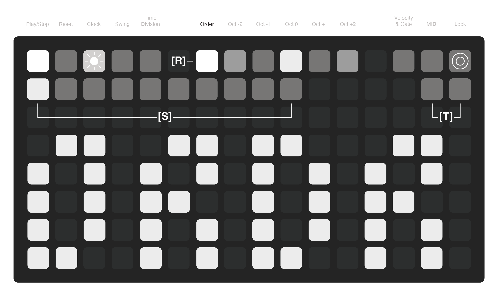

## Order - Types
| Type | Display | Description | Mod 1 | Mod 2 |
| :--- | :--- | :--- | :--- | :--- |
| Order | ORDR | Order plays the notes in the order in which they are input on the keyboard. | Reverse - Opposite of Played Order | Pendulum |
| Linear | LINE | Linear rearranges the input notes and plays the notes from low to high in the classic arpeggiator up pattern. | Reverse - Classic Down Pattern | Pendulum |
| Leap Frog | LEAP | Leap Frog uses a linear order from low to high, but the note sequence follows a leap two notes forward then leap one note back. It has a very bouncy feel. | Reverse - High to Low | Pendulum |
| Stagger | STAG | Stagger plays from low to high but plays a sequence of three notes forward and then moves back one note. It is useful in 3/4 time and feels a bit choppy. | Reverse - High to Low | Pendulum |
| Shift | SHFT | Shift plays from low to high but plays a sequence of four notes forward and then moves back one note. It is useful in 4/4 time and feels very fluid. | Reverse - High to Low | Pendulum |
| Spiral | SPRL | Spiral plays the notes from an outward to inward order. Based on the order that the notes are played, the spiral will either trend low to high or high to low. | Reverse - Inward to Outward | Pendulum |
| Anchor | ANCH | Anchor plays the notes from low to high but always returns to the first note pressed between each subsequent note. | Reverse - High to Low (from anchor) | Pendulum |
| Accumulate | ACCM | Accumulate plays the notes in the order they are played but starts with the first note subsequently adding the next note on each pass until all notes have played. | Reverse - Opposite of Played Order | Pendulum |
| Drunken Walk | WALK | Drunken walk is a generative sequence with equal probabilities of moving forward, repeating the same note, or moving backward. The notes are arranged from low to high, but the first note input is the origin. When adding octaves, the octaves are placed in the added order instead of linearly. | Wide Steps - Walk can move up to two steps instead of just one. | Edge Wrap - Walk can wrap from a high note to a low note or a low note to a high note. |
| Random | RAND | Random plays a completely random sequence based on the notes played. The notes might repeat sequentially. | Sequential Repeats are Avoided | Octave Clustering - Active octaves are played in the order they are pressed with clusters of random notes moving between the octaves. |

## Octave
**[U] Octave**  
The octave buttons adjust the range of the notes in the arpeggio sequence. The center octave button is the notes input on the keyboard.

The octave buttons are independent of each other, so they can be used to create gaps in octave ranges, giving a different level of control.

At least one octave button must be used at any one time, so if no octaves are selected the central octave is reinstated.
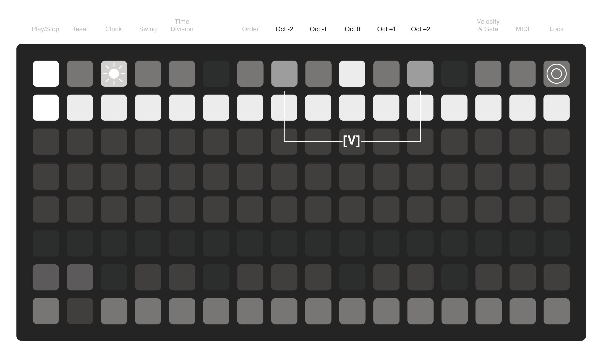

## Velocity & Gate
**[V] Velocity & Gate**  
This button toggles the page to input velocity and gate values for each step of the gate sequencer.

**[W] Current Step**  
Press anywhere on the grid to activate a step to edit. Each step can have an independent velocity value and gate length.

**[X] Velocity**  
Velocity values for a step can range between 8 and 127.

**[Y] Gate Length**  
Gate length values for a step can range between 6 and 100. Setting gate length to 100 will introduce ties when repeated notes are played.

_Shortcut:_  
Holding **[V]** and pressing a value on **[X]** or **[Y]** will set the value for all the steps in the gate sequencer simultaneously. This will also set the global velocity level and act as a offset point for edited velocities and gates when saving presets.
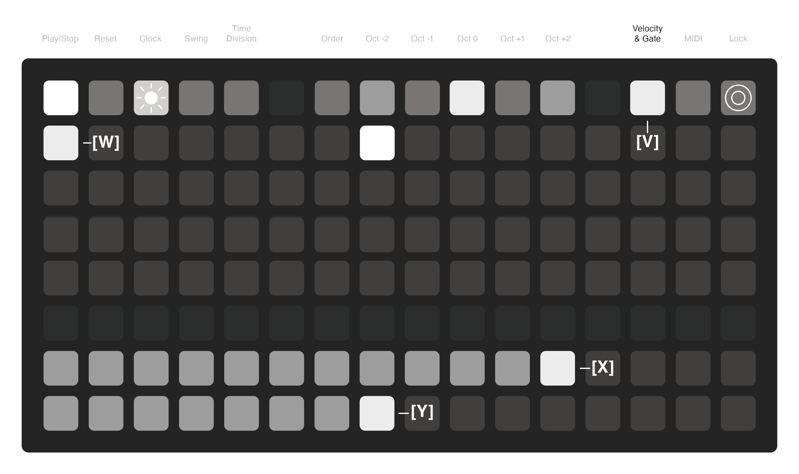

## MIDI Channel
**[Z] MIDI**  
This button toggles the MIDI page and shows the settings for each track. Each track can play a different MIDI note and be on a different MIDI channel.

**[AA] MIDI In Channel**  
This button shows the current MIDI in channel. By default, it is set to ALL. This is channel that receives clock, transport, and note input from an external device.

**[BB] MIDI Out Channel**  
This button shows the current MIDI out channel. By default, it is set to 1.

**[CC] Increments**  
The two sets of buttons next to the number display are for increasing or decreasing the MIDI channel.

MIDI channels can range from OFF, ALL, or 1–16.
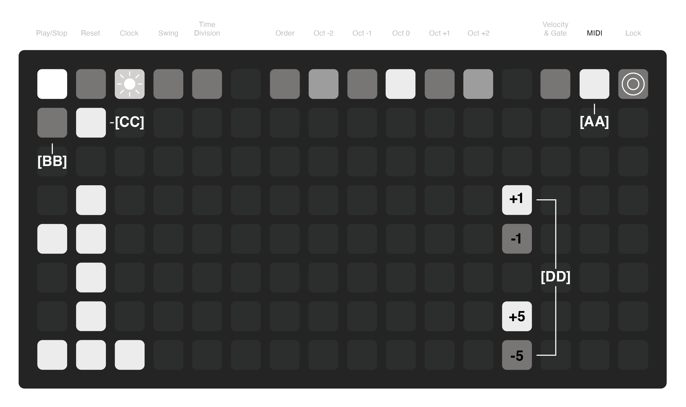

## Lock
**[DD] Lock**  
This button engages the lock feature that repeats the last 64 notes and gates played by the sequencer. While the sequencer is running, the 64-step buffer is always recording the notes, gates, and velocities, and MIDI channel. 

**[EE] Running Buffer**  
The current buffer is displayed using the grid of 64 steps and show the rests and velocities for each step. The start and end points of the buffer are represented by a pulsing light.

To set the start point, press a button on the grid. To set the end point, press a second button while holding down the first. The range of the buffer can be wrapped around the start by setting the end point before the start point.
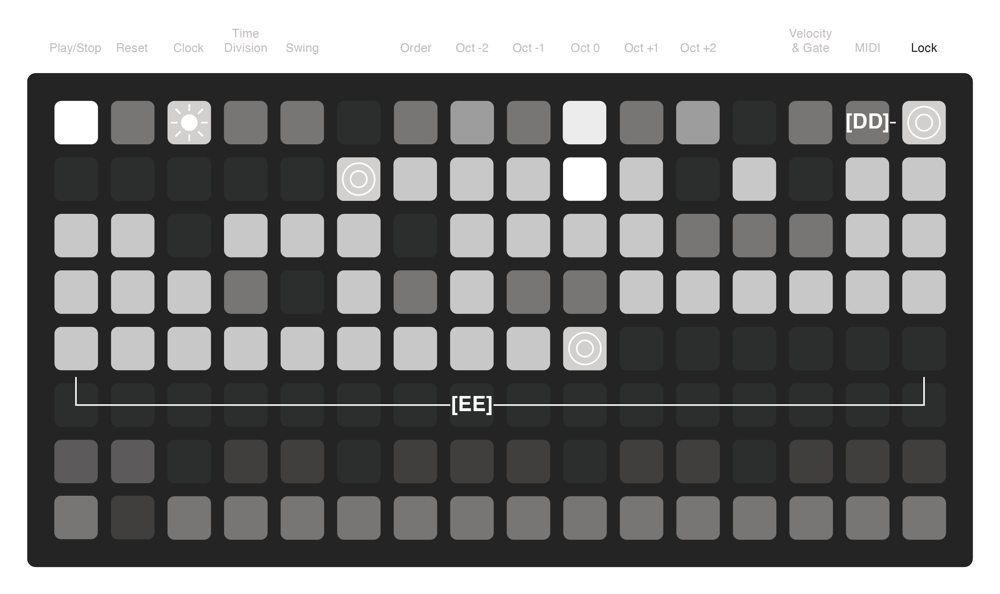

## Presets
**[FF] Presets**  
This button toggles the preset bank that replaces the keyboard to save and instantly load presets.

Each preset stores the track’s held notes, gates, velocities, internal BPM, clock division, swing, playback order, and octaves.

**[GG] Preset Select**  
Each key can be used to save a preset, making a total of 24 presets. Keys that are dim have not associated preset and the brightly lit key indicates the currently active preset.

To save a preset, hold the key button for 2 seconds until the slot blinks. Load a preset by tapping the desired button.

Presets are numbered 1-24. In diii you will see files that look like this:  
`pset_arpiii_1.lua`  

Global preset:  
`pset_arpiii_100.lua` 
serves as a global state memory. It recalls the last loaded preset to run when the script starts. It is updated when pressing any preset button.
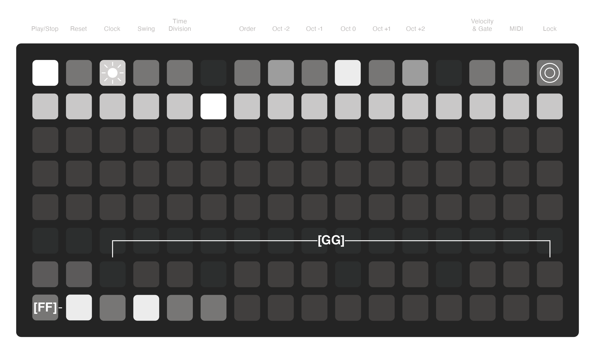
